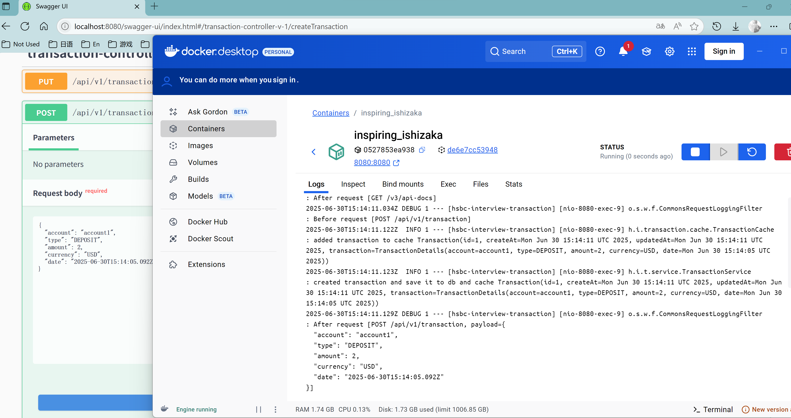
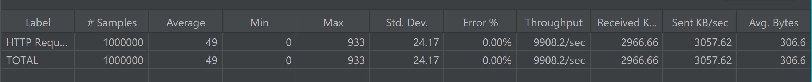
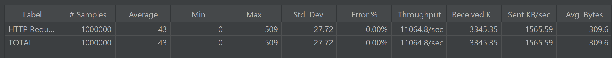
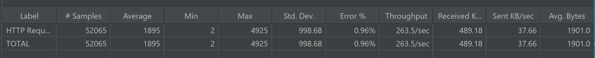
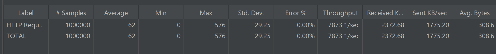
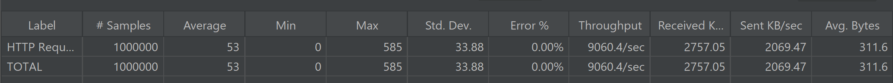

# HSBC-interview-transaction
This is a demo for the home task of HSBC interview on the subject 'transaction' (seen from below picture)

## Quick Start
1. 
   1. Running in IDE like Idea, making sure your IDE is running application by Maven (meaning you must select 'delegate run action to maven' in settings).
   2. You can call the apis with Swagger UI(http://localhost:8080/swagger-ui/index.html)
   3. H2 database has a UI as well (http://localhost:8080/h2-console/login.jsp and input JDBC URL with 'jdbc:h2:mem:transactions', username with 'hsbc', password with 'hsbc',seen in application.yml)

2. Optional
   1. Executing Compile action, you will see 'interview-0.0.1-SNAPSHOT.jar' in /target and using Docker to build image with the dockerfile in root directory, then running the image in docker container, note that you must specify a port pointing to 8080 when running by docker.
   2. You can access above Swagger UI and H2 UI, but the port should be the one you specified when starting the docker container. 

### Transaction models
1. [TransactionDetails.java](src/main/java/hsbc/interview/transaction/model/TransactionDetails.java) created by user
       1. account
       2. transaction type (deposit or withdrawal)
       3. amount (bigDecimal)
       4. currency (USD or CNY)
       5. transaction date (e.g. 2025-06-01)
2. [Transaction.java](src/main/java/hsbc/interview/transaction/model/Transaction.java) internal model
   1. TransactionDetails
   2. id (unique and auto increment)
   3. createdAt, updatedAt (internal management fields)
3. [TransactionDto.java](src/main/java/hsbc/interview/transaction/model/TransactionDto.java) model exposed to user
   1. id
   2. TransactionDetails

### APIs Explanation
1. Get    /api/v1/transactions/{page}/{size} - list all transactions with pagination
2. Get    /api/v1/transaction/{id} - get a transaction by id, if id does not exist, returns null
3. Post   /api/v1/transaction - create a new transaction with a TransactionDetails model in requestBody
4. Delete /api/v1/transaction/{id} - delete a transaction by id, if id does not exist, returns 400 BadRequest
5. Put    /api/v1/transaction/{id}/{amount} - modify the amount of a transaction by id and amount specified, if id does not exist, returns 400 BadRequest

### Implementation Details
1. Using H2 in-memory database as the data storage layer (H2 UI -> http://localhost:8080/h2-console/login.jsp and input JDBC URL with 'jdbc:h2:mem:transactions', username with 'hsbc', password with 'hsbc',seen in application.yml) 
2. Using Spring JPA to simplify the interaction with database
3. Using Caffeine to simulate the cache layer to enhance query method (Get /api/v1/transaction/{id}) and applying delayed double deletions policy to sync cache and db when updating transactions
4. Necessary validation on api input params are applied
5. A global exception handler is created to catch all exceptions and return corresponding error http codes
6. Swagger UI is integrated (http://localhost:8080/swagger-ui/index.html)
   
### Unit tests 
All core methods inside controller/service/repository/cache/validator are covered with unit tests

### Containerization
A docker file is created in the project and already validated in my local that it can be successfully built as an image and running in container.
Docker version in my local is 28.1.1

### Dependencies
1. spring-boot-starter-web: spring boot framework
2. spring-boot-starter-data-jpa: ORM 
3. h2: in memory database
4. springdoc-openapi-starter-webmvc-ui: swagger UI
5. caffeine: local cache
6. spring-boot-starter-test/reactor-test/spring-boot-starter-webflux: for unit test (reactor and webflux are for web test client)

### Performance Testing
Perf testing on all apis are executed with Jmeter in my local.

CPU: AMD Ryzen 7 5800H
RAM: 16GB

scale: 1,000,000 transactions

Perf testing result:
1. Add - 9908.2 requests/sec
   
2. Query by id - 11064.8 requests/sec
   
3. Query with page (size = 10) - 263.5 requests/sec
   
4. Modify - 7873.1 requests / sec
   
5. Delete - 9060.4 requests / sec
   
    

